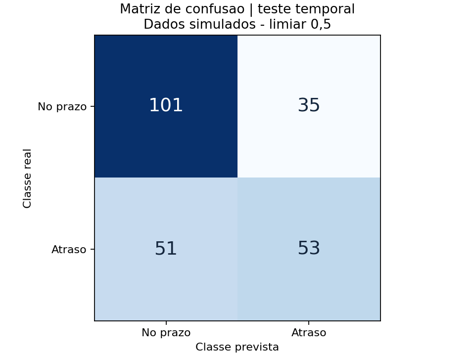

# Relatorio da execucao

Gerado em UTC: 2026-09-24T00:14:23.767628+00:00

## Qualidade dos dados

- Brutos: 1226
- Duplicatas removidas: 20
- Rejeitados: 6
- Validos: 1200
- Embargo temporal: 70

## Metricas do teste

| Indicador | Regressao logistica | Baseline |
|---|---:|---:|
| acuracia | 0.6417 | 0.5667 |
| acuracia_balanceada | 0.6261 | 0.5000 |
| precisao | 0.6023 | 0.0000 |
| recall | 0.5096 | 0.0000 |
| f1 | 0.5521 | 0.0000 |
| roc_auc | 0.7148 | 0.5000 |

O baseline usa a frequencia do alvo no treino. Limiar fixo: 0,5.
Precisao e recall referem-se a classe atraso=1. Precisao sem previsoes positivas e registrada como zero.
AUC fica N/A quando ha uma unica classe no conjunto avaliado.

## Metodo e limites

Divisao cronologica por dias; rotulo de atraso observado depois de 7 dias. Intervalos de 7 dias evitam usar rotulos indisponiveis no corte.
Medianas, limites de extremos, escala e categorias aprendidos somente no treino.
dias_entrega_real, identificador e alvo excluidos das entradas do modelo.
Este resultado mede somente um mecanismo de simulacao. Nao e validacao operacional.
Nao ajuste o modelo olhando o teste; novos ajustes exigem novo periodo final independente.

